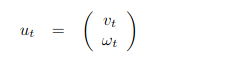
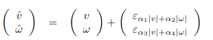
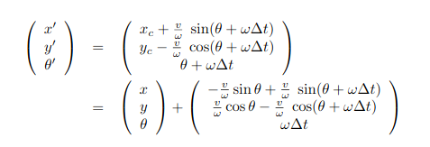
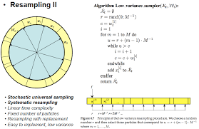

# Monte_carlo_localization
MCL Implementation for turtlebot3 localization in Ros/gazebo environmnet
########################################################################
]
## **_what is monte-carlo-localization?_**
### introduction:

 Monte Carlo localization (MCL) is one of the crucial approaches for robotics localization based on particle distribution over the pre-defined map. This distribution relies on the weighted scheme for each particle. MCL approach has gained attention to remedy the global localization and kidnapping problem. However, MCL suffers from computational complexity, resulting in a delay in acquiring the accurate pose of the robot. The majority of complexity stems from the map dimension, which requires a large number of particles.
Moreover, the observation model must be presented for each particle, leading to a vast computational burden. In this repository, the MCL node (programming by Python language) for turtlebot3 in gazebo/Rviz is implemented. by proposing a pre-caching algorithm, the MCL is improved in terms of computational complexity. The Idea behind the pre-cashing scheme is to simulate the laser range finder for each grid in an off-line way. Therefore, each cell in the map includes ranges for each beam, leading to a 3D matrix. For more detail, readers can refer to Lei Zhang et al. (2012).

### method:

 The proposed MCL algorithm is based on four steps, initialization, motion model (prediction), observation (correction), and resampling.

#### initialization:
 
 The algorithm remedies the global localization; for this measure, the particles are distributed all over the map, meaning the robot does not know anything about its location at the beginning.

 
#### velocity motion model:

 the motion model is based on velocity motion model presented in Probablstic Robotics: Sebastian Thrun et al.
 at time t the translational and rotational veolcities is presented as 

 

in real world all sensor data are subject to noise, so to have a simulation close to real world, some noise are added to velocities as following,

 after time delta t the robot will locate at new pose as,

#### observation:

 Observation plays a pose correction role (correction is more common in Kalman Filter localization). In the observation phase, the robot observes the world related to the position it is located. In Gazebo/turtlebot3, the range finder sensor with 360 beams is used to observe the world.
 At time t, the motion is predicted for each particle, then based on their pose, the pre-caching data obtained off-line is called. Afterward, the error can be calculated for each particle by comparing those data with the actual range finder data. Finally, the weighted array is computed based on the error so that each weighted element attributes to a particle.

 
#### stochastic universal sampling (SUS) algorithm:

 For this implementation, the SUS algorithm is exploited for the resampling phase of particles. It basically prioritizes those particles with high normalized weights. The idea behind this algorithm is simple; it represents the probability of repopulating a sample based on its weight. For example, the likelihood of re-producing a particle with a normalized weight of 0.4 is almost four times more than a particle with a normalized weight of 0.1.

the algorithm below illustrates the SUS resampling:

#####################################################################################
#### References:

Zhang, L., Zapata, R., & Lépinay, P. (2012). Self-adaptive Monte Carlo localization for mobile robots using range finders. Robotica, 30(2), 229-244. doi:10.1017/S0263574711000567

Thrun, S., Burgard, W., & Fox, D. (2005). Probabilistic Robotics (Intelligent Robotics and Autonomous Agents series), ser. Intelligent robotics and autonomous agents.

Particle Filter and Monte Carlo Localization (Cyrill Stachniss Youtube Channel) https://www.youtube.com/watch?v=MsYlueVDLI0

###########################################################################################################################

### how to use this respository?

As it is mentioned, to improve the efficiency of the MCL algorithm, the simulated sensor data are prepared offline. Hence before running the Roslaunch file, the user must run the precaching.py script, then a data.txt will be generated. We have used this txt file in the Roslaunch file.
This simulation is designed for Ros2 turtlebot3; however, it is valid for other simulation environments by changing some essential items, such as the size of the map (the map should be added for new environments), the name of topics, etc.

